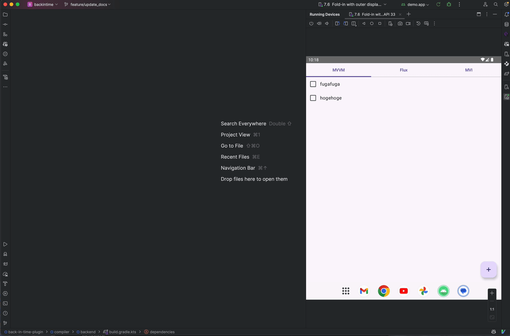

# back-in-time-plugin

[](https://central.sonatype.com/search?namespace=com.kitakkun.backintime)
[](http://kotlinlang.org)
[](https://github.com/kitakkun/back-in-time-plugin/blob/master/LICENSE.txt)


No more print debugging, No more repetitive manual debugging.

This plugin helps you to track state changes inside your application during its execution.
Also, you can easily revert the state to the previous one. We call it "back-in-time" debugging.

Currently, this plugin intended to be used in JVM or Android projects.
But we are planning to support other platforms in the future.



> [!IMPORTANT]
> This project is still a work in progress, and its API is unstable and may change without any
> notice.
> Using this plugin for a hobby project is fine, but we do not recommend using it for production
> projects yet.

## Getting Started

This section will guide you through the process of setting up the back-in-time plugin in your project.

### Gradle Setup

Releases of back-in-time-plugin are available in the Maven Central repository:

```kotlin
repositories {
    mavenCentral()
}
```

In build.gradle.kts:

```kotlin
plugins {
    id("com.kitakkun.backintime") version "<version>"
    kotlin("plugin.serialization") // the back-in-time plugin depends on kotlinx.serialization
}

dependencies {
    // Only @Serializable fields can be back-in-time debuggable
    implementation("org.jetbrains.kotlinx:kotlinx-serialization-json:<version>")
}

backInTime {
    // true by default
    enabled = true
    // need this for debugging external library classes
    configFilePath = "$projectDir/backintime.yaml"
}
```

You need to set `configFilePath` to debug external library classes like `kotlinx.coroutines.flow.MutableStateFlow`(We call them "Trackable StateHolder").
The compiler plugin refers to this file during compilation to understand how to make the them back-in-time debuggable.

For more information about the YAML configuration file and the concept of Trackable StateHolder,
please refer to the following documents:

- [YAML Configuration Guide](docs/yaml_configuration_guide.md)
- [Trackable StateHolder](docs/trackable_stateholder.md)

### Annotate your class

After syncing your project, annotations library for the back-in-time plugin will be available automatically.

Annotate your class with `@BackInTime` to make it back-in-time debuggable.
Make sure fields you want to debug are holding @Serializable value by kotlinx.serialization.

```kotlin
@BackInTime
class CounterStateHolder {
    var count = 0 // Make sure its field is @Serializable

    fun increment() {
        count++
    }
}
```

### Install the IntelliJ IDEA plugin

The IntelliJ IDEA plugin is available on the official JetBrains Marketplace.

<iframe width="245px" height="48px" src="https://plugins.jetbrains.com/embeddable/install/27261"></iframe>

Though it is not available in the Stable channel yet, you can manually download and install it.

You can also use the [standalone](tooling/standalone) version of the debugger built over Compose for Desktop.
The standalone version is not available in the GitHub releases for now, but we are planning to include it to releases in the future.

### Configure the entry point

You need to configure the entry point of your application to start the back-in-time debugger.
For Android, you can do this in the `onCreate` method of your `Application` class:

```kotlin
class MyApplication : Application() {
    @BackInTimeEntryPoint(host = "localhost", port = 8080)
    override fun onCreate() {
        super.onCreate()
    }
}
```

For JVM applications, you can do this in the `main` method:

```kotlin
@BackInTimeEntryPoint(host = "localhost", port = 8080)
fun main() {
}
```

The `host` and `port` parameters are used to specify the host and port of the WebSocket server.
After installing the IDE plugin, the WebSocket server will be started automatically.
You can check what port is used via the IDE plugin settings screen.

### Run your application and start debugging

Run your application and start the back-in-time debugger. That's it!
Now you can inspect the state of debuggable classes and execute back-in-time operations.


## How it works

This plugin comes with two phases: compile-time and runtime.

### Compile-time

At compile-time, this plugin finds the classes annotated with `@BackInTime` and generates the code
to track the changes of its state and a method to perform back-in-time operations.

For example, if you have the following class:

```kotlin
@BackInTime
class CounterStateHolder {
    var count = 0

    fun increment() {
        count++
    }
}
```

The plugin will modify the class as follows(not exact the same, just for explanation):

```kotlin
// Note that this is a pseudo code
@BackInTime
class CounterStateHolder : BackInTimeDebuggable {
    var count = 0
    // other internal properties will be generated

    init {
        register(this)
    }

    fun increment() {
        reportMethodInvocation("increment")
        count++
        reportValueChange("count", count)
    }

    override fun forceSetValue(propertySignature: String, jsonValue: String) {
        when (propertySignature) {
            "count" -> count = deserialize<Int>(jsonValue)
        }
    }
}
```

### Runtime

At runtime, inserted code works to enable the back-in-time debugging.
Communication between the plugin and the application is done via a WebSocket.
