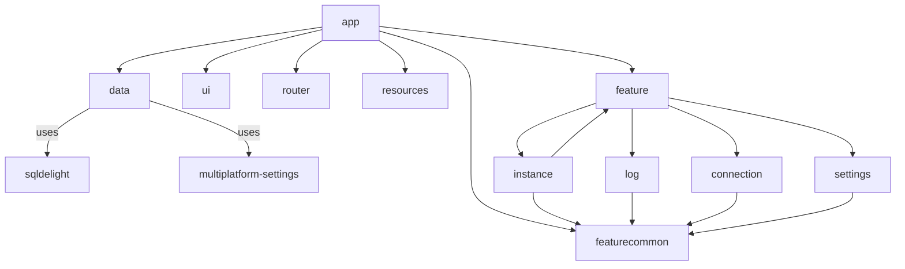

# backintime-debugger (WIP)

This project contains a standalone debugger app for back-in-time debugging. The app is fully written
in Compose Multiplatform.

> **NOTE**  
> The back-in-time debugger is still a work in progress. It may take some time to be available for
> everyone.

## Module Structure

- `app`: Contains the main application logic.
- `data`: Manages data and configurations with [SQLDelight](https://github.com/cashapp/sqldelight)
  and [Multiplatform Settings](https://github.com/russhwolf/multiplatform-settings).
- `ui`: Provides a design system, including theming for the app.
- `router`: Provides type-safe navigation destinations
  for [Navigation Compose](https://developer.android.com/develop/ui/compose/navigation#type-safety).
- `resources`: Provides Compose Multiplatform resources at the project level.
- `featurecommon`: Contains shared logic and utilities that are used in multiple features.
- `feature`:
    - `instance`: Provides instance-management features where actual back-in-time debugging takes
      place.
    - `log`: Displays raw event logs.
    - `connection`: Provides connection-management features, allowing you to view the status of the
      debugger server and connected apps.
    - `settings`: Provides options to configure app behavior.

