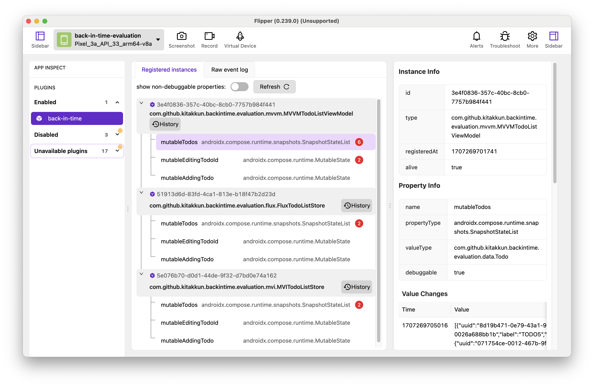

# flipper-plugin-back-in-time

[[English](README.md) | 日本語]

[back-in-time-plugin](https://github.com/kitakkun/back-in-time-plugin) を用いてコンパイルしたプログラムと連携し，
実際に flipper を介して back-in-time デバッグを行うためのプラグインです．



## デモ

### プロパティ情報の閲覧

https://github.com/kitakkun/flipper-plugin-back-in-time/assets/48154936/0bf7159b-3aea-49d1-bfee-8dca908c1b68

### 変更の追跡

https://github.com/kitakkun/flipper-plugin-back-in-time/assets/48154936/ad57283e-dee4-4bb2-a025-e7f12f2e61d4

### 状態の巻き戻し

https://github.com/kitakkun/flipper-plugin-back-in-time/assets/48154936/dd3bb86a-d366-44da-b25a-b323ca7dc570


## インストール

このプロジェクトは現在開発中であり，正式リリースはありません．
リポジトリをクローンして，ルートディレクトリで以下のコマンドを実行してください．

```sh
yarn pack
```

flipper-plugin-back-in-time-vx.x.x.tgz が生成されるので，Flipperから読み込み追加してください．
(More -> Add Plugins -> Install Plugins -> Select a flipper package)
